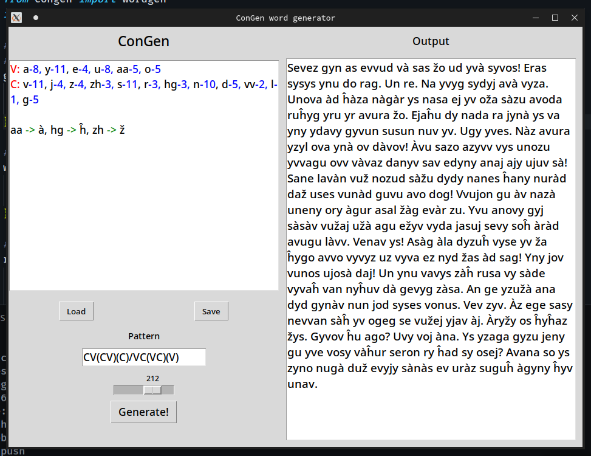

# ConGen

Congen genarates made-up words for conlangs using patterns and character groups.
Congen also creates pseudotext (fake sentences) so you can see what the words would look like in a text.

# Features

- An python library for generating words & text
- Easy to use GUI
- Load & save config from files
- Weighted chances of spesific letters
- Advanced patterns with probabilities & groups
- Pseudotext generation
- IPA translation
- Rewrites / character replacement

<br/>

## Gui

Run `gui.py` to use the interface.

</img>

<br/>

## Patterns

The pattern specifies what order characters will be in to generate words. As an example, the pattern `CV(CV)(CV)/VCV(C)` generates words with either one consonant and one vowel with 2 optional repetitions, or a vowel, a consonant and a vowel with an optional last consonant. 

`(x)` Only includes x in a word 50% of the time

`x/y` Either includes x or y

<br/>

## Cgg files

Cgg (congen groups) files contain letter groups and rewrites. They can be loaded into the Gui from a file, or typed directly into the text box. In cgg text you can create groups of letters, assign weights and create rewrites.

Example:

```hs // hs is being used because it provides hilighting of group names and weights
V: a-8, y-11, e-4, u-8, aa-5, o-5
C: v-11, j-4, z-4, zh-3, s-11, r-3, hg-2, n-10, d-5, vv-2, l-1, g-5

aa->à, hg->ĥ, zh->ž
```

Output:

```Roža onosu nu oduv ud avvuz on ej ovanu. Sy vosod žyn jàž sàž ajyv vyvu do vàrud evveĥà asyv žysu yza vyjaĥ ežav. Àvu vyĥa an àr nadav ug no vožà. Suden vadon. Von ovy và gy. Az và uvvy ny nos ogovu nun ovy àseg savva us vy.```

<br/>

## wordgen.py library

The wordgen library can be used to quickly generate words from any python file.


Here is an example of the usage:
```py
from congen import wordgen

groups = {
    "C": ["p", "t", "k", "s", "m", "n"],
    "V": ["a", "i", "u"]
}

pattern = "CV(CV)(CV)/VCV(C)"

words = wordgen.generate_words(100, pattern, groups, weights=weights, rewrites=rewrites)

pseudotext = wordgen.generate_pseudotext(words)
print(pseudotext)
```

Output:

```
Ipum inap atu pusi ukat na ikup! Tusa apu iku apap tatimi anik asu.
Usa pa! Apam upik sutata nisu uku ka amu sipu isu namu?
Mu imi ikun nina ki aman pati kakita?
Apip amu simuma tamu! Apim ku puti. Pa uki.
```

